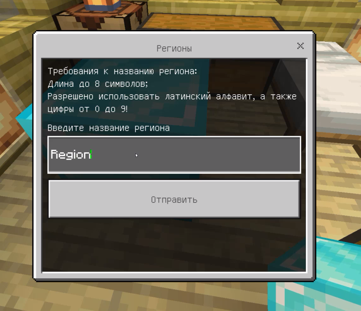

# 🎁Region Plugin!

❗ Using SQLiteCpp library(included already).

📖 Plugin Lang: RU

✨ Supports Minecraft:BE 1.20.

| Native language  |    C++   |
| ----------------- | -------- |

😋 Add special system, which'll protect your area by your own blocks!

| Command                                 | Description                                                   |
| --------------------------------------- | ------------------------------------------------------------- |
| `/rg help`                              | Information about using region plugin(edit by settings.json)  |
| `/rg addmember <region> <playername>`   | Add member in region                                          |
| `/rg removemember <region> <playername>`| Remove member from region                                     |
| `/rg info`                              | Information about local region                                |

Releases <a href="https://github.com/MineCoder77/Region/releases/tag/Region">here</a>.

-----



# 💎 My huge diamond thanks for using this code!

If u want to compilte it by yourself, do the next steps:

1. Download .zip source_code by this command:
```sh
git clone --recurse-submodule https://github.com/MineCoder77/Region.git
```
2. Unzip it.
3. Update your SDK:
```sh
cd SDK
git checkout main
git pull
```
3. Edit info about plugin in version.h(if you need).
4. Compile it!
-----
